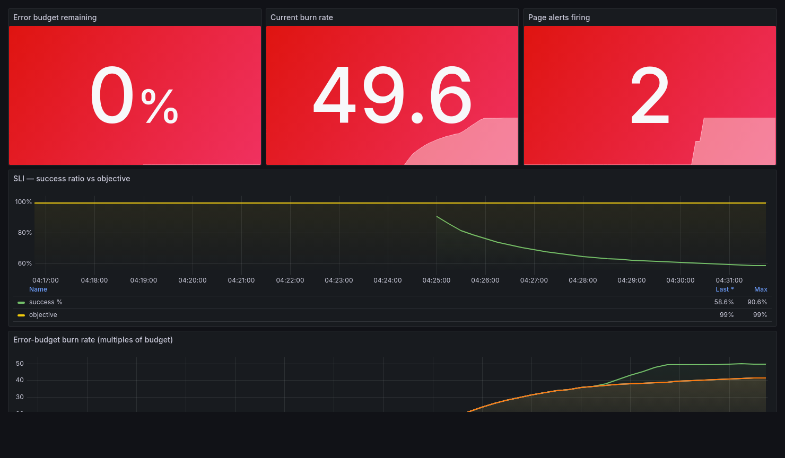
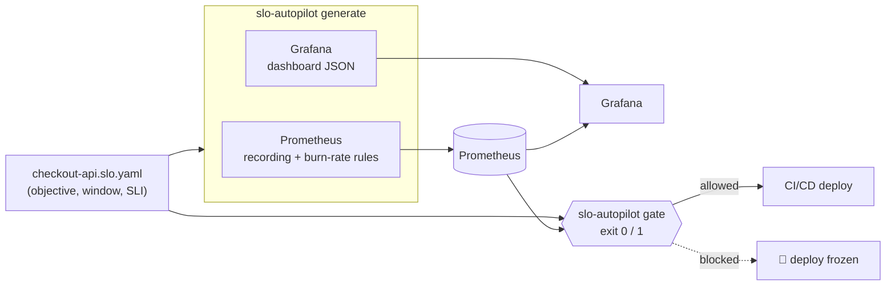

# SLO Autopilot

**Error-budget-driven release gating for Prometheus.** Declare a service level
objective once, in YAML. Get the burn-rate alerts, the Grafana dashboard, the
live error-budget report, and a CI/CD gate that **freezes deploys when you are
out of budget** — all generated from that one spec, all agreeing on the same math.

[](https://github.com/abhisheksoppanna/slo-autopilot/actions/workflows/ci.yml)
[](https://goreportcard.com/report/github.com/abhisheksoppanna/slo-autopilot)


```console
$ slo-autopilot gate -f checkout-api.slo.yaml --prometheus http://localhost:9090

[BLOCK] checkout-api-availability
       • error budget exhausted (2000.0% of budget consumed over 30d)
       • active fast burn: 20.0x budget over the 1h window (page severity)

✗ gate: deploy frozen by error-budget policy
$ echo $?
1
```

That exit code is the whole point. Drop the gate into a pipeline and a service
that is on fire stops shipping new code — automatically, with an audit trail,
instead of relying on whoever is awake to remember the rule.

The generated Grafana dashboard during a live error-budget burn — budget exhausted,
page alerts firing, the SLI diving below its objective:



---

## Why

Every SRE team has the same unwritten rule: *don't ship when you're out of error
budget.* It almost never gets enforced, because enforcing it by hand means
someone eyeballing a dashboard at deploy time. SLO Autopilot makes the rule
executable:

- **One source of truth.** Humans edit a small YAML spec. Alerts, dashboards and
  the gate are generated — they can't drift apart, because they're the same
  definition compiled three ways.
- **The page and the freeze are the same signal.** The thing that wakes you up
  (a multi-window burn-rate alert) and the thing that blocks your deploy are
  computed identically. No second, subtly-different notion of "unhealthy."
- **Textbook method, not a guess.** The burn-rate policy is the one from the
  [Google SRE Workbook](https://sre.google/workbook/alerting-on-slos/) —
  multi-window, multi-burn-rate, with sane page/ticket severities.

## The loop



## 60-second demo

Requires Docker. No API keys, no cloud account.

```bash
git clone https://github.com/abhisheksoppanna/slo-autopilot
cd slo-autopilot
make demo-up
```

This brings up a sample payment service (emitting real RED metrics), Prometheus
loaded with the generated rules, and Grafana with the generated dashboard:

| | |
|---|---|
| **Grafana** | http://localhost:3000 → dashboard *"SLO — checkout-api-demo"* |
| **Prometheus** | http://localhost:9090/alerts → the burn-rate alerts |
| **Service** | http://localhost:8080/checkout |

Now start a fire and watch the budget burn:

```bash
curl 'http://localhost:8080/chaos?errors=0.4'   # inject a 40% error rate
make demo-budget                                 # watch the budget drain
make demo-gate                                    # the gate now exits 1
```

```console
$ make demo-budget

checkout-api-demo  payment-api
  objective   99%   error budget 1%
  budget left ░░░░░░░░░░░░░░░░░░░░░░░░   0.0%
  consumed    180.0% of budget over the compliance window
  burn rate by window (× budget):
    5m       1.80x  (fires at 14.4x)  ok
    15m      1.80x  (fires at  6.0x)  ok
    1h       1.80x  (fires at  3.0x)  ok
    3h       1.80x  (fires at  1.0x)  TICKET
```

Put the fire out and watch everything recover:

```bash
curl 'http://localhost:8080/chaos?reset=1'
make demo-down
```

> The demo uses a **time-compressed** burn-rate policy (`--policy fast`) so a
> full burn happens in minutes. Production uses the standard 1h/6h/1d/3d windows.

## What it generates

From this spec:

```yaml
apiVersion: slo-autopilot/v1
metadata:
  name: checkout-api-availability
  service: checkout-api
  team: payments
spec:
  objective: 99.9          # 99.9% success → 0.1% error budget
  window: 30d
  indicator:
    type: ratio
    errorMetric: 'http_requests_total{service="checkout-api", code=~"5.."}'
    totalMetric: 'http_requests_total{service="checkout-api"}'
```

**Prometheus rules** — one recording rule per window, then the multi-window
burn-rate alerts that reference them:

```yaml
- record: slo:sli_error:ratio_rate1h
  expr: sum(rate(http_requests_total{service="checkout-api",code=~"5.."}[1h]))
        / clamp_min(sum(rate(http_requests_total{service="checkout-api"}[1h])), 1e-9)
  labels: { slo: checkout-api-availability, service: checkout-api }

- alert: CheckoutApiAvailabilityErrorBudgetBurnPage1h
  expr: |
    ( slo:sli_error:ratio_rate1h{slo="checkout-api-availability"} > 0.0144
      and
      slo:sli_error:ratio_rate5m{slo="checkout-api-availability"} > 0.0144 )
  for: 2m
  labels: { severity: page, burn_window: 1h }
```

**A Grafana dashboard** — budget remaining, current burn rate, page-alert status,
SLI vs. objective, and burn rate per window over time. Panels bind to a fixed
datasource UID so provisioning is zero-config.

**A release gate** — `slo-autopilot gate` reads the live budget and exits non-zero
when policy says don't ship.

## Install

```bash
# Install the CLI (requires Go 1.23+)
go install github.com/abhisheksoppanna/slo-autopilot/cmd/slo-autopilot@latest

# …or build from a clone
make build && ./bin/slo-autopilot --help
```

## CLI

```text
slo-autopilot validate   Check SLO specs for correctness
slo-autopilot generate   Emit Prometheus rules + a Grafana dashboard
slo-autopilot budget     Report the live error-budget position
slo-autopilot gate       Decide whether a deploy may proceed (exit 1 = blocked)
```

```console
$ slo-autopilot validate -f examples/checkout-api.slo.yaml
✓ 1 SLO(s) valid
  checkout-api-availability  checkout-api  objective 99.9% over 30d  (budget 0.1%)

$ slo-autopilot generate -f examples/checkout-api.slo.yaml --out-dir deploy/generated
✓ rules       deploy/generated/checkout-api-availability.rules.yaml
✓ dashboard   deploy/generated/checkout-api-availability.dashboard.json
```

`budget` and `gate` both take `--prometheus <url>`, `--policy standard|fast`, and
`--json` for machine-readable output. `gate` adds `--min-remaining <0..1>` (block
below this much budget left) and `--block-fast-burn` (block on an active page
burn, on by default).

## Use it in CI/CD

A composite Action ships in [`.github/actions/slo-gate`](.github/actions/slo-gate).
Put it in front of your deploy step and the job stops if the budget says so:

```yaml
- name: SLO error-budget gate
  uses: ./.github/actions/slo-gate
  with:
    spec: examples/checkout-api.slo.yaml
    prometheus-url: https://prometheus.internal
    min-remaining: "0.10"   # require at least 10% of the budget to remain

- name: Deploy
  run: ./deploy.sh          # only runs if the gate above passed
```

## How the math works

Burn rate normalises the error rate against the budget, so one policy fits a 99%
and a 99.99% SLO alike:

```
burn_rate = error_ratio / error_budget
```

The generated `standard` policy (Google SRE Workbook, tuned for 30 days):

| Severity | Long | Short | Factor | Burns if sustained |
|----------|------|-------|--------|--------------------|
| page     | 1h   | 5m    | 14.4   | 2% of budget over 1h |
| page     | 6h   | 30m   | 6      | 5% over 6h |
| ticket   | 1d   | 2h    | 3      | 10% over 1d |
| ticket   | 3d   | 6h    | 1      | 10% over 3d |

Full explanation: **[docs/BURN_RATE.md](docs/BURN_RATE.md)**.
Spec reference: **[docs/SLO_SPEC.md](docs/SLO_SPEC.md)**.

## Design notes

- **Go, standard library where it counts.** The Prometheus query client is ~120
  lines of `net/http`; the CLI uses the std `flag` package. The only runtime
  dependencies are `yaml.v3` (specs) and `client_golang` (the demo service).
- **Generated artifacts are committed and checked.** CI regenerates the demo
  rules and dashboard and fails on any drift from the spec — the tool dogfoods
  itself.
- **The gate distinguishes outcomes from failures.** Exit `1` = deploy blocked
  by policy (an expected answer). Exit `2` = misuse or a tooling error (bad
  flag, Prometheus unreachable). A pipeline can treat the two differently.
- **No data ≠ failure.** An idle service with no traffic reports a healthy,
  full budget rather than a divide-by-zero — the gate never blocks on silence.

## Project layout

```
cmd/slo-autopilot/      CLI: validate · generate · budget · gate
internal/
  spec/                 SLO YAML model, loader, validation, duration parsing
  burnrate/             multi-window burn-rate policy (SRE Workbook)
  promrules/            Prometheus recording + alert rule generation
  dashboard/            Grafana dashboard JSON generation
  prom/                 minimal Prometheus query client
  budget/               live error-budget computation
  gate/                 release-gate decision logic
services/payment-api/   sample instrumented service for the demo
deploy/                 docker-compose stack: service + Prometheus + Grafana
.github/                CI workflow + the slo-gate composite action
docs/                   burn-rate methodology + spec reference
```

## Roadmap

- Latency SLIs (histogram quantiles) alongside the ratio method
- Alertmanager routing templates per `team` label
- `slo-autopilot diff` to preview rule/dashboard changes in PRs
- Native Sloth / OpenSLO spec import

## License

MIT © [Abhishek Soppanna](https://www.abhisheksoppanna.com)
